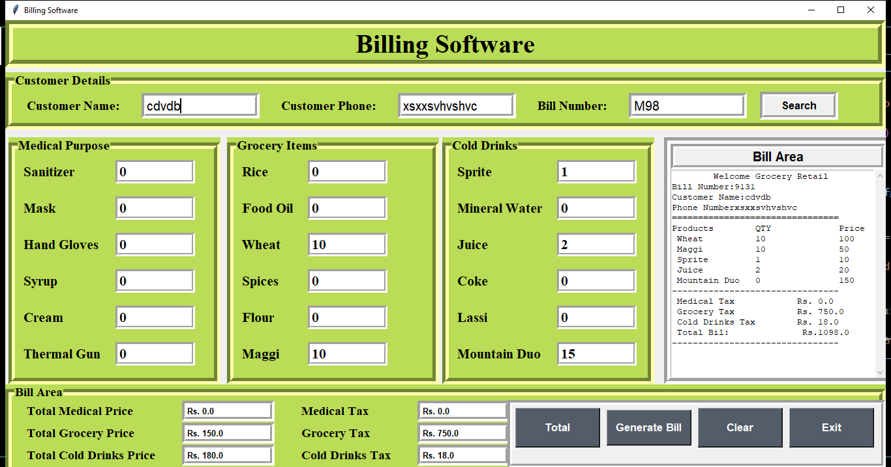

# Billing_system

 

  

A simple GUI-based Billing Management System built using Python with `tkinter` for the interface, designed to manage customer bills, calculate totals, and generate receipts.

## Features
- Add customer details (name, items, quantities, prices).
- Calculate total bill amount with tax (if applicable).
- Generate and display a printable receipt.
- Clear input fields for new entries.
- Exit the application safely.
- User-friendly interface with real-time updates.

## Prerequisites
- Python 3.x
- Required Python library:
  - `tkinter` (usually included with Python)
    
     
